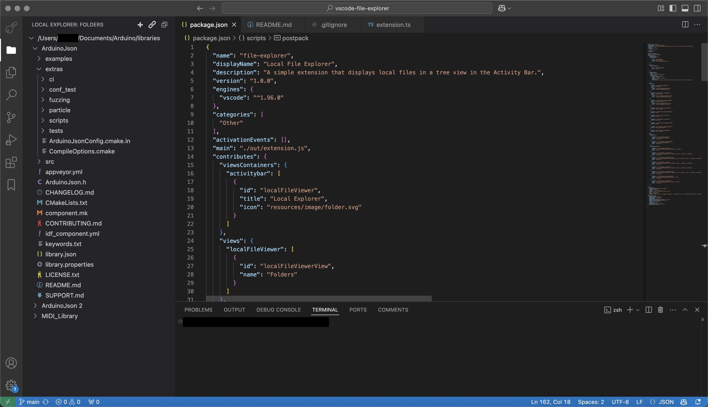
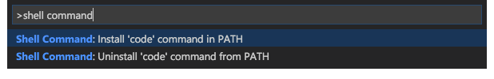
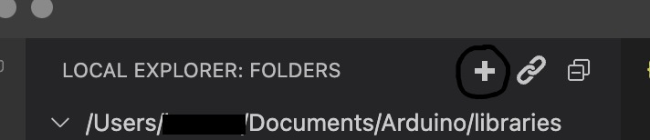

# Simple File Explorer

A Visual Studio Code extension that displays local files in a tree view in the Activity Bar. This extension allows you to configure multiple folders, navigate their contents, and perform common file operations—all without leaving VS Code.

## Features

- **Tree View of Local Folders** – Displays a customizable list of folder paths.
- **Add / Remove Folders** – Manage which folders appear in your explorer from within VS Code.
- **Create Files / Folders** – Quickly create a new file or folder directly in the explorer.
- **Delete & Rename** – Easily delete or rename files/folders.
- **Reveal in Finder** (macOS) – Opens the selected item in macOS Finder.
- **Open in Default App** – Cross-platform support to open files in their system default application.
- **Open in VS Code** – Quickly open a file or folder in a separate VS Code window.
To use this feature, you must have the `code` command installed and available in your system PATH.

- **Toggle Hidden Files** – Show or hide dotfiles (e.g., `.gitignore`).

## Installation

1. **Download / Clone** – Get this repository or its `.vsix` package.
2. **Install via VSIX** (optional if not installing from the Marketplace):
   1. Open VS Code
   2. Press `F1` or `Ctrl + Shift + P` and type: `Extensions: Install from VSIX...`
   3. Select the `.vsix` file and install.
3. **Reload / Restart** – After installation, reload your VS Code window if necessary.

## Configuration

The extension provides a Button in the top right corner of the explorer to add or remove folders.

- **Show Hidden Files**: Toggle via the command `localFileViewer.toggleShowHidden`, or via the Tree View Title Bar menu (the little link icon).

## Known Issues / Limitations

- **Windows & Linux Reveal**: The `Reveal in Finder` command currently only supports macOS. Future updates may add similar commands for Windows Explorer or Linux file managers.
- **Performance**: Very large folders (or deep nested structures) might take a moment to load or refresh.
